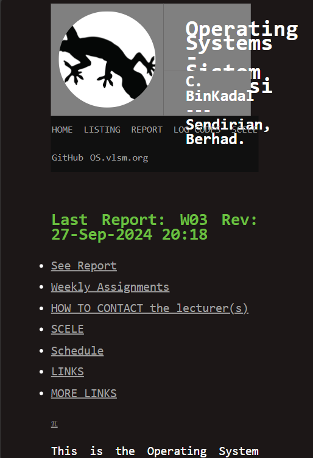
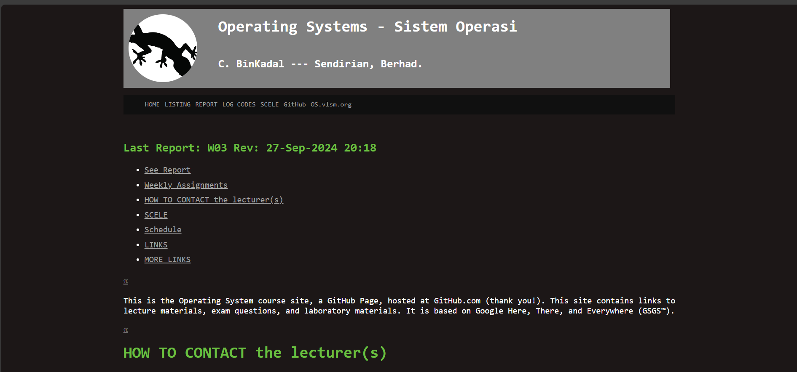
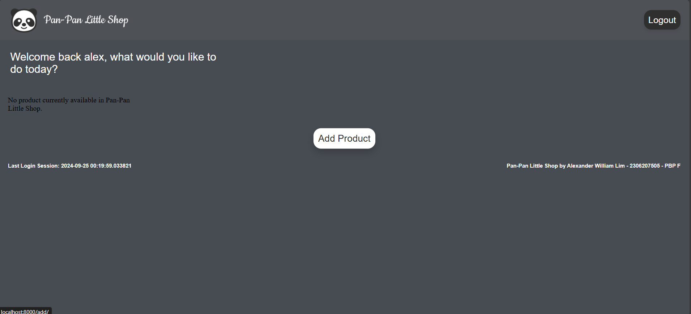
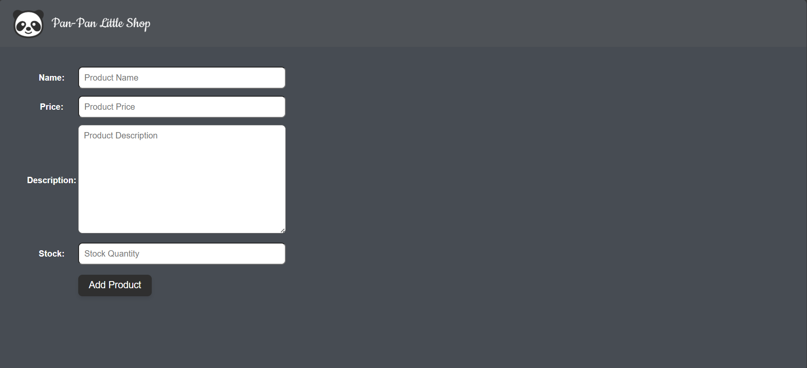
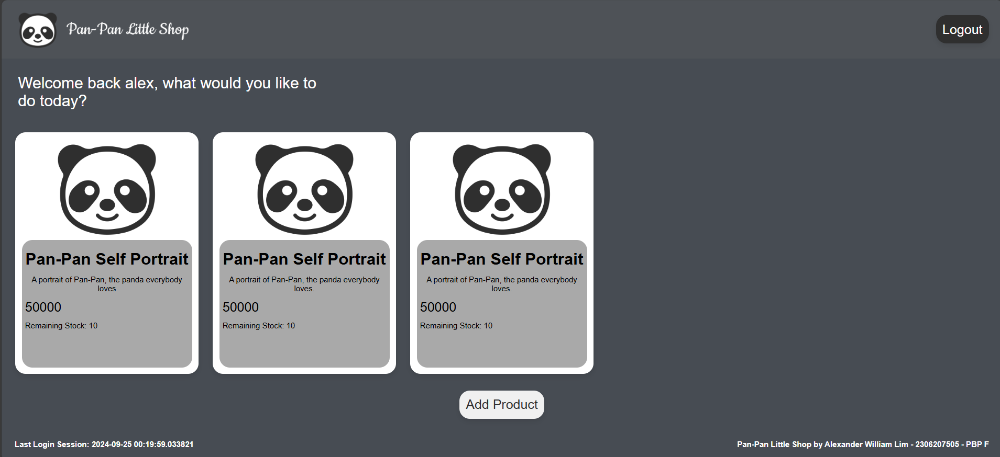
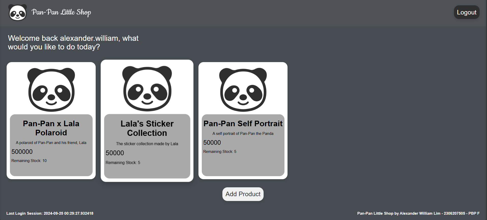
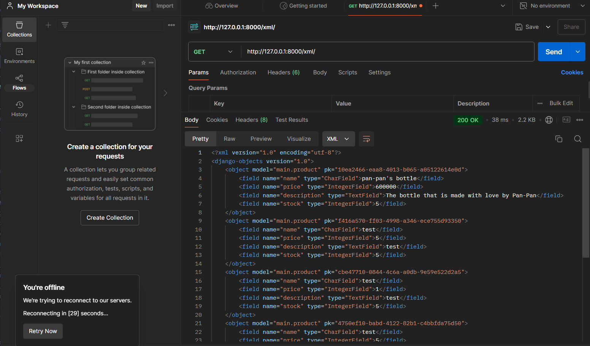
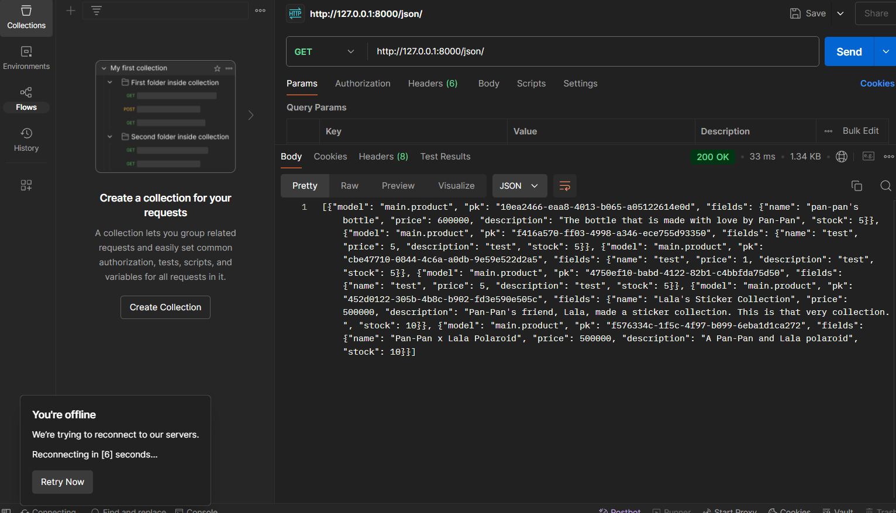
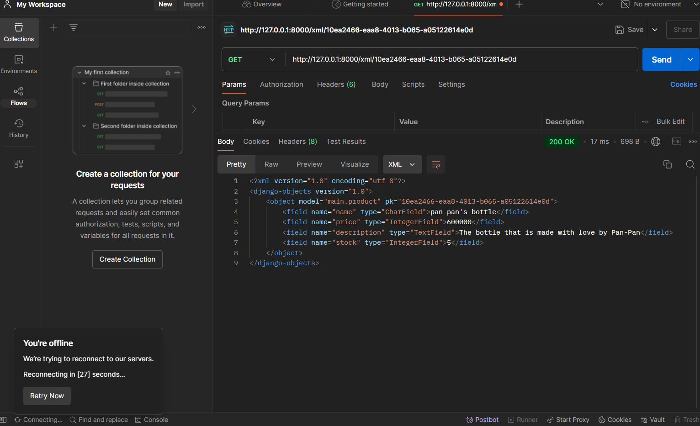
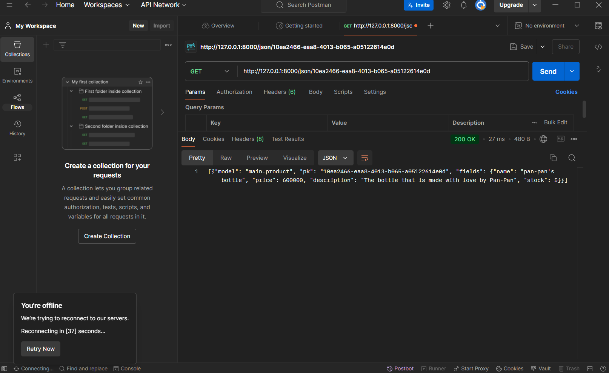

# <p align="center"></p>

This web application is a trading hub, specifically for art and crafts. It is made specifically for one of my college projects, PBP (Programming Berbasis Platform).

<br>

# ⚙️ **USAGE**<br>
You can access the live web application directly from the link below:
[LINK TO WEBPAGE](http://alexander-william-panpanlittleshop.pbp.cs.ui.ac.id/)

If you prefer to open it locally, however, simply clone this repository into your local folder. Make sure to install the requirements using the command `pip install -r requirements.txt`. Without doing so, the Django module would not be detected and the web application would not launch.

<br>

# 🛠️ **CONTRIBUTION**<br>
If you wish to contribute to this project, you can clone the project directly and edit it with any code editor to your liking, assuming that you have Django already setup. If not, you should first get Django installed into your device before proceeding as the application is fully developed within the Django framework.

Here a few links that you might find helpful in setting up your project:
1. [Real Python's Tutorial](https://realpython.com/django-setup/)
2. [Django Official Documentation](https://docs.djangoproject.com/en/5.0/intro/tutorial01/)

<br>

# 📃 **LICENSE**<br>
This project is licensed under the MIT License - refer to the LICENSE file for more details.

<br>

# 📝 **ASSIGNMENT**<br>
**Name** : Alexander William Lim <br>
**NPM** : 2306207505 <br>
**Class** : PBP F

## **TUGAS 5**<br>
### **Implementasi Step-by-Step Styling pada Project**
1. Buatlah sebuah direktori pada root bernama `templates/css` dan masukkan sebuah file baru bernama `global.css`

2. Isi `global.css` untuk memasukkan custom styling yang belum didefinisikan oleh Tailwind CSS.

3. Pada `base.html`, masukkan beberapa lines sehingga akan terlihat seperti ini:
```html

<!DOCTYPE html>
<html lang="en">
  <head>
    <meta charset="UTF-8" />
    <meta name="viewport" content="width=device-width, initial-scale=1.0" />
     
    <link rel="stylesheet" href="">
    <link rel="preconnect" href="https://fonts.googleapis.com">
    <link rel="preconnect" href="https://fonts.gstatic.com" crossorigin>
    <link rel="icon" type="image/png" href="">
    <script src="https://cdn.tailwindcss.com/"></script>
  </head>
  <body>
     
  </body>
</html>
```

4. Pada direktori yang sama, tambahkan juga sebuah file bernama `navbar.html`. Contoh isi dari file tersebut adalah sebagai berikut:
```html


<nav class="bg-zinc-600 shadow-lg fixed top-0 left-0 z-40 w-screen">
    <div class="max-w-full ml-4 mr-6">
      <div class="flex flex-row justify-between h-16">
        <div class="flex items-center">
          
          <a href="" class="text-center text-white font-bold py-2 px-4 rounded-lg transition duration-300 ml-2">
            Home
          </a>
          <a href="" class="text-center text-white font-bold py-2 px-4 rounded-lg transition duration-300 ml-2">
            Products
          </a>
          <a href="" class="text-center text-white font-bold py-2 px-4 rounded-lg transition duration-300 ml-2">
            Categories
          </a>
          <a href="" class="text-center text-white font-bold py-2 px-4 rounded-lg transition duration-300 ml-2">
            About
          </a>
        </div>
        <div class="hidden md:flex items-center">
          
            <a href="" class="text-center bg-stone-800 hover:bg-stone-900 text-white font-bold py-2 px-4 rounded-lg transition duration-300">
              Logout
            </a>
          
            <a href="" class="text-center bg-blue-500 hover:bg-blue-600 text-white font-bold py-2 px-4 rounded-lg transition duration-300 mr-2">
              Login
            </a>
            <a href="" class="text-center bg-green-500 hover:bg-green-600 text-white font-bold py-2 px-4 rounded-lg transition duration-300">
              Register
            </a>
          
        </div>
        <div class="md:hidden flex items-center">
          <button class="mobile-menu-button">
            <svg class="w-6 h-6 text-white" fill="none" stroke-linecap="round" stroke-linejoin="round" stroke-width="2" viewBox="0 0 24 24" stroke="currentColor">
              <path d="M4 6h16M4 12h16M4 18h16"></path>
            </svg>
          </button>
        </div>
      </div>
    </div>
    <!-- Mobile menu -->
    <div class="mobile-menu hidden md:hidden  px-4 w-full md:max-w-full">
      <div class="pt-2 pb-3 space-y-1 mx-auto">
        
          <span class="block text-gray-300 px-3 py-2">Welcome, {{ user.username }}</span>
          <a href="" class="block text-center bg-red-500 hover:bg-red-600 text-white font-bold py-2 px-4 rounded-lg transition duration-300">
            Logout
          </a>
        
          <a href="" class="block text-center bg-blue-500 hover:bg-blue-600 text-white font-bold py-2 px-4 rounded-lg transition duration-300 mb-2">
            Login
          </a>
          <a href="" class="block text-center bg-green-500 hover:bg-green-600 text-white font-bold py-2 px-4 rounded-lgtransition duration-300">
            Register
          </a>
        
      </div>
    </div>
    <script>
      const btn = document.querySelector("button.mobile-menu-button");
      const menu = document.querySelector(".mobile-menu");
    
      btn.addEventListener("click", () => {
        menu.classList.toggle("hidden");
      });
    </script>
  </nav>
```

5. Karena kita telah menambahkan Tailwind CSS ke dalam proyek yang sedang dikerjakan, kita bisa menggunakannya untuk melakukan *inline-styling*.

6. Pada `register.html`, `login.html`, dan `add_product.html`, gunakan *inline-styling* untuk melakukan kustomisasi pada tampilan-tampilan tersebut agar lebih enak dilihat. Ini dilakukan sesuai keinginan masing-masing

7. Pada `main.html`, kita juga menggunakan *inline-styling* tetapi dengan tambahan `navbar.html` yang telah kita buat. Kita dapat menampilkan `navbar.html` pada tampilan `main` dengan menggunakan tag ``

8. Pada `main.html`, jangan lupa juga untuk memasukkan *button-button* yang akan ditekan oleh user untuk melakukan *logout* dan *add product*.

9. Lakukan juga styling untuk menampilkan kartu serta opsi untuk menghapus dan mengedit produk kita.

10. Untuk fitur *edit* dan *delete*, seperti minggu-minggu sebelumnya, kita pertama harus menambahkan kedua fungsi tersebut pada `views.py` seperti berikut:
```python
...

# Fungsi-fungsi lainnya

def edit_product(request, id):
    # Get the product based on product ID
    product = Product.objects.get(pk=id)

    # Set product as an instance of form
    form = ProductForm(request.POST or None, instance=product)

    if form.is_valid() and request.method == "POST":
        # Save form and return to main page
        form.save()
        return redirect('main:show_main')
    
    context = {'form': form}
    return render(request, "edit_product.html", context)

def delete_product(request, id):
    # Get Product based on product ID
    product = Product.objects.get(pk=id)

    # Delete the product
    product.delete()

    # Return to main page
    return HttpResponseRedirect(reverse('main:show_main'))
```

11. Setelah membuat fitur, kita harus melakukan routing agar fungsi yang kita gunakan dapat ditampilkan dan digunakan oleh pengguna aplikasi. Kita dapat melakukan ini dengan melakukan *import* dan menambahkan *path* url untuk fungsi tersebut sebagai berikut:
```python
...

urlpatterns = [
    ...
    path('edit/<uuid:id>/', edit_product, name='edit_product'),
    path('delete/<uuid:id>/', delete_product, name='delete_product'),
]
```

12. Setelah itu, kita juga harus ingat untuk melakuan *styling* yang *responsive* dengan menambahkan kustomisasi berbeda untuk media yang berbeda. Ini dapat dilakukan menggunakan *styling* yang terpisah namun disembunyikan bila ketentuan tertentu dipenuhi (misalnya bila layar pengguna lebih besar dari suatu size tertentu, maka hide tampilan untuk layar yang lebih kecil).

### **Mengapa responsive design menjadi konsep yang penting dalam pengembangan aplikasi web?**
Saat kita melakukan pengembangan aplikasi, kita tidak dapat memastikan bahwa pengguna yang mengakses dan menggunakan aplikasi web kita pasti akan menggunakan suatu layar dengan size tertentu. Oleh karena itu, kita harus melakukan *styling* yang berbeda agar dapat menutupi semua kemungkinan tersebut. Contohnya, bila kita hanya menggunakan layar laptop sebagai referensi kita, maka kemungkinan besar desain yang telah kita lakukan tidak akan terlihat semenarik ataupun benar pada layar yang lebih kecil seperti smartphone dan tablet.

Sebuah contoh aplikasi web tanpa responsive design dapat dilihat dari sini:


Padahal, pada layar yang lebih besar, tampilannya adalah seperti ini:


Dari sini dapat kita lihat pentingnya *responsive design* saat melakukan pengembangan pada aplikasi web kita.

### **Perbedaan margin, border, dan padding**
**A. Margin**
Margin adalah ruang diluar batas elemen. Ini digunakan untuk membuat jarak dari satu elemen ke elemen lainnya.

Contoh implementasi external CSS adalah sebagai berikut:
```css
.example {
    margin: 20px; /* Margin di semua sisi */
    margin-top: 10px; /* Margin atas */
    margin-right: 15px; /* Margin kanan */
    margin-bottom: 10px; /* Margin bawah */
    margin-left: 15px; /* Margin kiri */
}
```
**B. Border**
Border adalah garis yang mengelilingi elemen. Ini merupakan sebuah pembatas antara margin dan padding. Modifikasi dapat dilakukan secara keseluruhan atau hanya pada satu sisi.

Contoh implementasinya adalah sebagai berikut:
```css
.example {
    border: 2px solid black; /* Border di semua sisi */
    border-top: 2px dashed red; /* Border atas */
    border-right: 2px dotted green; /* Border kanan */
    border-bottom: 2px solid blue; /* Border bawah */
    border-left: 2px double yellow; /* Border kiri */
}
```

**C. Padding**
Padding merupakan ruang yang berada dalam elemen. Ini digunakan untuk membuat jarak antara isi atau konten elemen dengan pembatas elemen.

Contoh implementasinya adalah sebagai berikut:
```css
.example {
    padding: 20px; /* Padding di semua sisi */
    padding-top: 10px; /* Padding atas */
    padding-right: 15px; /* Padding kanan */
    padding-bottom: 10px; /* Padding bawah */
    padding-left: 15px; /* Padding kiri */
}
```

### **Flex-box dan Grid layout**
**A. Flex-box**
Sebuah layout CSS yang dirancang untuk mengatur dan menyelaraskan item dalam sebuah container (misalnya div). Ini sangat berguna untuk membuat sebuah layout yang responsif dan fleksibel.

Ada beberapa properti yang dapat dimiliki oleh flexbox, berikut adalah beberapa di antaranya:
- `display: flex;`: Mengaktifkan flexbox pada container.
- `flex-direction`: Menentukan arah sumbu utama.
- `justify-content`: Menyelaraskan item sepanjang sumbu utama.
- `align-items`: Menyelaraskan item sepanjang sumbi silang.

Contoh implementasi:
```css
.container {
    display: flex;
    flex-direction: row;
    justify-content: center;
    align-items: center;
    flex-wrap: wrap;
}

.item {
    flex: 1;
    padding: 10px;
}
```

**B. Grid Layout**
Layout CSS yang dirancang untuk membuat layout dua dimensi yang lebih kompleks. Ini memudahkan kita untuk mengatur item ataupun elemen dalam baris dan kolom, serta memberikan kita kemampuan untuk memisahkan items dengan gap tertentu.

Ada beberapa properti pada grid layout yang dapat digunakan:
- `display: grid;`: Mengaktifkan grid layout pada container.
- `grid-template-columns`: Menentukan jumlah dan ukuran kolom dalam grid.
- `grid-template-rows`: Menentukan jumlah dan ukuran baris dalam grid.
- `gap`: Menentukan jarak antar item dalam grid (row-gap, column-gap).

Contoh implementasinya adalah sebagai berikut:
```css
.container {
    display: grid;
    grid-template-columns: repeat(3, 1fr);
    grid-template-rows: auto;
    gap: 10px;
}

.item {
    padding: 10px;
    background-color: lightgray;
}
```

## **TUGAS 4**<br>
### **Implementasi Step-by-Step Autentikasi, Session, dan Cookies**

**A. Autentikasi**<br>
1. Buka `views.py` dan tambahkan fungsi-fungsi `register`, `login_user`, dan `logout_user` sebagai berikut:

- `register`:
```python
def register(request):
    form = UserCreationForm()

    if request.method == "POST":
        form = UserCreationForm(request.POST)
        if form.is_valid():
            form.save()
            messages.success(request, 'Your account has been successfully created!')
            return redirect('main:login')
    context = {'form':form}
    return render(request, 'register.html', context)
```

- `login_user`:
```python
def login_user(request):
   if request.method == 'POST':
      form = AuthenticationForm(data=request.POST)

      if form.is_valid():
            user = form.get_user()
            login(request, user)
            return redirect('main:show_main')

   else:
      form = AuthenticationForm(request)
   context = {'form': form}
   return render(request, 'login.html', context)
```

- `logout_user`:
```python
def logout_user(request):
    logout(request)
    return redirect('main:login')
```


2. Jangan lupa pula untuk menambahkan kode `import` yang sesuai seperti ini:
```python
from main.views import register
from django.contrib.auth.forms import UserCreationForm, AuthenticationForm
from django.contrib.auth import authenticate, login, logout
```

3. Setelah memasukkan semua fungsi `views.py`, mulailah merancang tampilan `html` dari login page dan register page. Masukkan kedua berkas tersebut ke dalam direktori `templates/`. Contohnya adalah sebagai berikut:

- `login.html`
```python



<title>Pan-Pan Little Shop</title>



<div class="login">
  <h1>Login</h1>

  <form method="POST" action="">
    
    <table>
      {{ form.as_table }}
      <tr>
        <td></td>
        <td><input class="btn login_btn" type="submit" value="Login" /></td>
      </tr>
    </table>
  </form>

  
  <ul>
    
    <li>{{ message }}</li>
    
  </ul>
   Don't have an account yet?
  <a href="">Register Now</a>
</div>


```

- `register.html`
```html


<div class="login">
  <h1>Register</h1>

  <form method="POST">
    
    <table>
      {{ form.as_table }}
      <tr>
        <td></td>
        <td><input type="submit" name="submit" value="Daftar" /></td>
      </tr>
    </table>
  </form>

  
  <ul>
    
    <li>{{ message }}</li>
    
  </ul>
  
</div>


- `register.html`
```


4. Sesuaikan `main.html` agar dapat melakukan logout dengan menekan sebuah tombol. Contohnya bisa seperti ini:
```html
...
<a href="">
    <button>Logout</button>
</a>
...
```

5. Pada berkas `urls.py`, jangan lupa untuk menambahkan `import` code untuk setiap fungsi yang telah dimasukkan ke dalam `views.py` seperti berikut ini:
```python
...
from main.views import register, login_user, logout_user
```

6. Tambahkan pula *path urls* ke dalam `urls.py` sehingga pemroses *routing* dapat berjalan dengan baik. Contohnya adalah sebagai berikut:
```python
...
path('register/', register, name='register'),
path('login/', login_user, name='login'),
path('logout/', logout_user, name='logout'),
```

**B. Pembuatan Akun Pengguna dengan Dummy Data**
1. Buka aplikasi web pada http://localhost:8000

2. Pencet `Register Now` pada tampilan login, dan daftarkan akun dengan memasukkan input pada field yang tersedia sesuai dengan ketentuan yang telah diberikan. Lalu pencet daftar

3. Ulangi step 2 untuk pengguna lainnya.

4. Login dengan akun yang telah dibuat, lalu pencet *button* `Add Product`.


5. Anda akan dialihkan kepada tampilan baru sebagai berikut:


6. Masukkan input sesuai ketentuan field, dan pencet tombol `Add Product`.

7. Lakukan ini tiga kali sampai mendapatkan 3 dummy data.

8. Logout dan lakukan step 4-7 untuk akun lainnya, sehingga tampilan akhir main untuk kedua akun akan terlihat seperti ini:



<br>

**C. Menghubungkan User dengan Product**
1. Buka `models.py` dan tambahkan *Foreign Key* `User` pada badan `Product` seperti ini:
```python
from django.db import models
from django.contrib.auth.models import User
import uuid

class Product(models.Model):
    user = models.ForeignKey(User, on_delete=models.CASCADE)
    id = models.UUIDField(primary_key=True, default=uuid.uuid4, editable=False)
    name = models.CharField(max_length=255)
    price = models.IntegerField()
    description = models.TextField()
    stock = models.IntegerField()

    @property
    def is_product_available(self):
        return self.stock > 0
``` 
2. Jangan lupa untuk melakukan *command* di bawah ini setelah melakukan perubahan terhadap `models.py`:
```shell
python manage.py makemigrations
python manage.py migrate
```

3. Pada fungsi `login_user` yang terdapat di dalam `views.py`, pastikan detail user berupa last_login disimpan sebagai sebuah *session cookie*.
```python
...
import datetime

def login_user():
    ...
    if form.is_valid():
            user = form.get_user()
            login(request, user)
            response = HttpResponseRedirect(reverse("main:show_main"))
            response.set_cookie('last_login', str(datetime.datetime.now()))
            return response
    ...
```

4. Simpan `last_login` sebagai sebuah context pada `show_main`
```python
def show_main():
    ...
    context = {
        'name' : request.user.username,
        'price': 'Rp. 200.000',
        'stock': '10',
        'description': 'A self portrait of Pan-Pan, the panda.',
        'products': products,
        'last_login': request.COOKIES['last_login'],
    }
    ...
```

5. Pada `main.html` tambahkan beberapa bagian untuk menampilkan detail user seperti `username` dan `last_login`. Salah satu contoh adalah sebagai berikut:
```html
...
<div class="welcome-msg">
        <p>Welcome back {{ name }}, what would you like to do today?</p>
</div>
...
<div class="wrapper">
    <div class="footer">
        <p>Last Login Session: {{ last_login }}<p></p>
        <p>
            Pan-Pan Little Shop by Alexander William Lim - 2306207505 - PBP F
        </p>
    </div>
</div>
...
```

### Perbedaan `HttpResponseRedirect()` dan `redirect()`<br>
Inti dari kedua fungsi tersebut sebenarnya sama, yaitu untuk mengalihkan pengguna ke suatu URL yang telah terdaftar pada urls.py. Namun, ada beberapa perbedaan dalam cara kerja kedua fungsi:

1. `HttpResponseRedirect()`<br>
Fungsi ini adalah sebuah fungsi yang menerima URL lengkap atau relatif sebagai argumen. Argumen tersebut nantinya akan diterima sehingga aplikasi web dapat membuat sebuah request sehingga user dapat diarahkan menuju URL tersebut. Namun, fungsi ini tidak dapat menerima fungsi `views.py` lain dan hanya menerima URL.

2. `redirect()`<br>
Perbedaan fungsi ini dengan fungsi `HttpRepsponseRedirect()` adalah fleksibilitasnya. Ini karena fungsi tersebut memiliki kemampuan untuk menerima berbagai jenis argumen, seperti URL, nama tampilan (nama fungsi pada views.py), dan bahkan objek model yang nantinya akan di proses oleh fungsi dan dikembalikan sebagai `HttpResponseRedirect`.<br><br>

Lalu, pada kasus apa saja keduanya sebaiknya digunakan? Untuk `HttpResponseRedirect()`, kita tahu bahwa parameter yang diterima merupakan sebuah tipe data berupa URL. Oleh karena itu, biasanya fungsi tersebut akan lebih sering digunakan pada **pengalihan dasar** yang tidak memerlukan *programming logic* yang berat. Selain itu, fungsi tersebut juga lebih sering digunakan pada ***external redirect*** atau pengalihan ke website ataupun aplikasi di luar domain yang sekarang user berada.<br><br>

Sementara itu, fungsi `redirect()` lebih sering digunakan pada kasus-kasus dimana fleksibilitas dangat dibutuhkan, seperti saat kita ingin memiliki parameter berupa **URL bernama**, **URL dengan parameter (filter)**, **fungsi views**, dan **URL terasosiasi dengan objek model**. Tentunya, kita tetap masih bisa menggunakan fungsi ini untuk mengalihkan user ke suatu URL tertentu seperti pada implementasi `HttpResponseRedirect`. 

### **Cara kerja penghubungan model Product dengan User**<br>
Secara konseptual, penghubungan model suatu objek dengan *entity* lain dilakukan dengan memberikan atau menaruh sebuah ***Foreign Key*** pada model objek. Pada konteks Tugas 4, sebuah ***Foreign Key*** berupa `User` akan di-*assign* kepada model `Product`.

Implementasinya secara pemrograman adalah sebagai berikut:
```python
from django.contrib.auth.models import User

class Product(models.Model): 
    # Other attribute...
    user = models.ForeignKey(User, on_delete=models.CASCADE)
    # Other attribute...
```
Pada potongan kode di atas, ada beberapa bagian yang perlu diperhatikan. Yang pertama adalah penambahan field `user` yang mengandung ***Foreign Key*** yang terdiri dari sebuah entitas `User` dan parameter lainnya. Yang kedua adalah bagaiman opsi `on_delete=models.CASCADE` akan berpengaruh terhadap logic web kita. Kegunaan potongan kode tersebut secara garis besar hanyalah untuk menghapus semua hal yang terkait dengan `user`, saat entitas atau object yang telah disimpan di database terakit dengan `user` dihapus. Ini merupakan sebuah aksi pencegahan agar tidak adanya entri produk yang tidak memiliki pemilik.

### ***Authentication*** vs ***Authorization***<br>
Walaupun keduanya terdengar mirip, faktanya adalah bahwa kedua term tersebut sangatlah berbeda. Ini karena masing-masing dari proses tersebut memiliki tugas masing-masing yang penting dalam keamanan siber daripada suatu aplikasi web.<br>

1. ***Authentication***<br>
*Authentication* atau autentikasi adalah sebuah proses verifikasi identitas seorang user atau sistem. Ini meyakinkan bahwa entitas yang berusahan untuk mengakses suatu sistem adalah benar mereka sendiri. Sebuah contoh yang sering kita lihat adalah bagaimana banyak sekali aplikasi meminta ***credentials*** para pengguna sebelum bisa mengakses aplikasi ataupun tampilan utama daripada aplikasinya. Ini dapat berupa *username* dan *password*, ataupun data biometris seperti sidik jari.

2. ***Authorization***<br>
*Authorization* ataua otorisasi adalah sebuah proses penentuan apa yang boleh dilakukan dan diakses oleh pengguna yang telah terverifikasi. Proses ini mengontrol akses kepada *resources* dan aksi-aksi tergantung tingkatan izin dari penggunannya. Implementasi otorisasi dapat dilihat dengan bagaimana beberapa laman webpage tidak dapat diakses jika tidak memiliki izin tertentu sehingga pengguna tidak akan bisa melihatnya ataupun mengubahnya. Ini juga dapat dilihat dengan bagaimana pengguna web tidak bisa mengubah elemen-elemen yang terlampir pada halamannya jika bukan merupakan *website administrator*

### **Bagaimana Django mengingat user yang pernah login?**<br>
Pada pengembangan program berbasis platform, ada dua hal yang perlu diingat, yaitu ***session*** dan ***cookies***. Kedua hal itu lah yang digunakan oleh sebuah perangkat lunak untuk dapat mengingat user yang pernah masuk dan terverifikasi oleh aplikasi web tersebut. 

*Session* digunakan oleh Django untuk menyimpan informasi mengenai user pada server. Setiap kali user login dan diverifikasi, Django akan membuat sebuah entri sesi baru yang akan disimpan di dalam *database* ataupun di *backend* sesi yang telah dikonfigurasi. Sementara itu, *cookie* merupakan sebuah ID sesi yang diberikan kepada pengguna setiap kali sebuah entri sesi baru dibuat oleh Django. ID sesi ini akan disimpan di dalam browser user dan dikirim kembali kepada server setiap kali user melakukan sebuah *request* sehingga user tidak perlu melakukan login lagi untuk setiap permintaan yang dilakukan.

### ***Cookies* dan tingkat keamanannya**<br>
Tentunya kegunaan *cookies* tidak berhenti sampai pada mengingat login session user, tetapi juga digunakan pada beragam hal lainnya, seperti penyimpanan preferensi pengguna, pelacakan aktivitas pengguna, personalisasi konten, dan juga keranjang belanja pada aplikasi *e-commerce*.<br><br>
Walaupun kegunaan *cookies* sangat beragam, ini juga meningkatkan adanya potensi kelemahan suatu aplikasi web melalui *cookies* tersebut. Ini dapat terjadi bila misalnya tidak ada pengolahan *cookies* yang baik dari pengembang aplikasi web sehingga para penyerang siber dapat menggunakan kelemahan tersebut untuk mengambil ataupun membocorkan data. Beberapa contoh akibat kelalaian adalah sebagai berikut:
1. Cross-Site Request Forgery (CSRF) - sebuah jenis serangan di mana penyerang melakukan pemaksaaan pada pengguna terautentikasi sehingga mereka dapat mengirimkan permintaan tidak diinginkan ke aplikasi web yang mereka terautentikasi. Ini dapat merugikan pengguna seperti adanya perubahan data ataupun transaksi tidak sah.

2. Cross-Site Scripting (XSS) - sebuah jenis serangan di mana penyeran melakukan penyuntikan skrip berbahaya ke dalam halaman web yang sedang diakses oleh pengguna lain. Serangan ini nantinya dapat digunakan oleh penyerang untuk mencuri informasi sensitif, seperti *session cookie*, ataupun mengubah tampilan web.


## **TUGAS 3**<br>
### **Step-by-Step Form Setup and Data Delivery Implementation**<br>

**A. Konfigurasi Form**
1. Buatlah sebuah class dengan nama `ProductForm` dalam sebuah berkas baru bernama `forms.py`. Form ini akan digunakan untuk menambahkan produk pada app `main`. Isilah class tersebut sebagai berikut:
```python
class ProductForm(ModelForm):
    class Meta:
        model = Product
        fields = ['name', 'price', 'description', 'stock']
        widgets = {
            'name': forms.TextInput(attrs={'class': 'form-control', 'placeholder': 'Product Name'}),
            'description': forms.Textarea(attrs={'class': 'form-control', 'placeholder': 'Product Description'}),
            'price': forms.NumberInput(attrs={'class': 'form-control', 'placeholder': 'Product Price'}),
            'stock': forms.NumberInput(attrs={'class': 'form-control', 'placeholder': 'Stock Quantity'}),
        }
```

2. Form tersebut nantinya akan ditampilkan saat user melakukan request. Request tersebut akan di proses oleh sebuah fungsi di `views.py` yang seperti berikut:
```python
def add_product(request):
    form = ProductForm(request.POST or None)

    if form.is_valid() and request.method == "POST":
        form.save()
        return redirect("main:show_main")

    context = {'form': form}
    return render(request, "add_product.html", context)
```

**B. Implementasi Data Delivery**
1. Pada `views.py`, tambahkan 4 fungsi baru untuk memroses data yang ada pada database sehingga dapat ditampilkan dalam bentuk json ataupun xml. 

Dua fungsi pertama digunakan untuk menampilkan semua produk masing-masing dalam format json dan xml, dua fungsi lainnya digunakan untuk menampilkan produk sesuai id terpilih dalam format json atau xml.

- `show_xml()`:

```python
def show_xml(request):
    data = Product.objects.all()
    return HttpResponse(serializers.serialize("xml", data), content_type="application/xml")
```

- `show_json()`

```python
def show_json(request):
    data = Product.objects.all()
    return HttpResponse(serializers.serialize("json", data), content_type="application/json")
```

- `show_xml_by_id()`:
```python
def show_xml_by_id(request, id):
    data = Product.objects.filter(pk=id)
    return HttpResponse(serializers.serialize("xml", data), content_type="application/xml")

```

- `show_json_by_id()`:
```python
def show_json_by_id(request, id):
    data = Product.objects.filter(pk=id)
    return HttpResponse(serializers.serialize("json", data), content_type="application/json")
```

2. Setelah menambahkan fungsi-fungsi tersebut pada `views.py`, routing URL untuk setiap **views** juga harus ditambahkan pada berkas `urls.py` dalam direktori main.

```python
...
urlpatterns = [
    path('', show_main, name='show_main'),
    path('add/', add_product, name='add_product'),
    path('xml/', show_xml, name='show_xml'),
    path('json/', show_json, name='show_json'),
    path('xml/<str:id>/', show_xml_by_id, name='show_xml_by_id'),
    path('json/<str:id>/', show_json_by_id, name='show_json_by_id'),
]
...
```

### Mengapa sebuah platform perlu memiliki *data delivery*?

*Data delivery* diperlukan oleh sebuah platform karena beberapa alasan. Berikut adalah beberapa alasan utama mengapa sebuah plaform membutuhkan *data delivery* yang baik:
1. Memungkinkan pengguna atau aplikasi lain untuk menerima data secara *real-time*. 
2. Memungkinkan kontrol lebih baik terhadap siapa yang dapat mengakses data serta distribusi daripada data tersebut, sehingga risiko keamanan dan kebocoran data dapat dikurangi.
3. Waktu respons dari platform dapat menjadi lebih cepat sehingga meningkatkan kepuasan dan produktivitas pengguna.

### XML vs JSON

Dalam konteks aplikasi modern, menurut saya JSON lebih baik daripada XML oleh karena beberapa alasan. 
1. JSON lebih mudah dibaca daripada XML karena menggunakan kurung kerawal `{}` yang diisi dengan data yang ingin ditampilkan, sementara XML menggunakan tags.
2. JSON juga lebih `lightweight` dalam performa penyimpanan. Ini karena JSON tidak perlu menggunakan tags pembuka dan penutup berlebihan untuk menampilkan data. 
3. JSON juga sudah secara alami terintegrasi dengan JavaScript sehingga dapat lebih mudah untuk diparse menjadi sebuah objek JavaScript tanpa melakukan banyak konversi.

### Fungsi `is_valid()` pada form Django

Fungsi `is_valid()`, sesuai namanya, merupakan sebuah fungsi yang dipanggil untuk melakukan validasi data yang di masukkan oleh user. Data type yang valid ditentukan sebelumnya pada `models.py` dari objek yang ingin dibuat.

Fungsi `is_valid()` mengembalikan sebuah nilai dengan data type `boolean`. Jika data yang dimasukkan sesuai dengan models yang telah ditentukan, maka fungsi akan mengembalikan nilai `True`, dan `False` bila sebaliknya. Ini dapat kita gunakan sebagai condition pada conditionals ataupun looping sampai user memasukkan sebuah nilai input yang sesuai.

### Pentingnya `csrf_token` saat membuat form di Django

`csrf_token` merupakan sebuah token yang digunakan untuk melindungi aplikasi dari salah satu serangan kemanan, **CSRF** (Cross-Site Request Forgery), yang melakukan penargetan pada aplikasi web dengan mengirimkan permintaan palsu dari sumber yang tidak sah.

`csrf_token` ini juga bersifat unik, sehingga sangat sulit ditebak oleh penyerang. `csrf_token` ini akan disertakan dalam sebuah form setiap use mengakses atau membuka form. Saat melakukan pengiriman form, token ini akan diverifikasi dan dicek apakah sesuai untuk mengecek apakah berasal dari pengguna yang sah.

### Hasil akses data URL dari Postman
1. Semua produk dalam XML

2. Semua produk dalam JSON

3. Produk tertentu dalam XML

4. Produk tertentu dalam JSON


## **TUGAS 2**<br>
### **Step-by-Step Project Setup Guide** <br>

**A. Konfigurasi Awal Proyek**
1. Pastikan Django sudah terinstall pada perangkat yang akan digunakan.

2. Dengan asumsi Django sudah terinstall, buatlah sebuah direktori lokal baru dengan nama `Pan Pan Little Shop`.

3. Buka terminal baru pada direktori tersebut, dan inisialisasi virtual environment menggunakan perintah berikut.<br>
    ```bash
    python -m venv env
    ```

4. Untuk mengaktifkan virtual environment, perintah berikut dapat digunakan.
    ```bash
    env\Scripts\activate
    ```

5. Setelah selesai melakukan setup virtual environment, buatlah sebuah berkas bernama `requirements.txt` pada direktori yang sama. Isi dari berkas adalah sebagai berikut.
    ```txt
    django
    gunicorn
    whitenoise
    psycopg2-binary
    requests
    urllib3
    ```

6. Lalu, lakukan instalasi *dependencies* menggunakan perintah berikut.
    ```bash
    pip install -r requirements.txt
    ```

7. Hanya setelah melakukan semua langkah-langkah diatas, proyek Django dapat diinisialisasi.
    ```bash
    django-admin startproject pan-pan-little-shop .
    ```

8. Konfigurasi `settings.py` dan menambahkan `localhost` dan `127.0.0.1` pada `ALLOWED_HOSTS`. Tujuan penambahan ini adalah agar kita dapat melakukan local hosting pada perangkat yang kita gunakan.

**B. Persiapan Awal Implementasi MVT**<br>

1. Buka terminal pada direktori proyek `pan-pan-little-shop`. Lalu, jalankan perintah berikut untuk membuat menginisialisasi *main app* baru.
    ```bash
    python manage.py starapp main
    ```

2. Daftarkan `'main'` sebagai item terakhir ke dalam daftar aplikasi `INSTALLED_APPS` pada `settings.py` dari direktori proyek.
    ```python
    INSTALLED_APPS = [
        ...,
        'main'
    ]
    ```

**C. Konfigurasi Templates Main App**<br>
1. Pada direktori `main`, buatlah sebuah direktori baru bernama `templates`.

2. Pada direktori baru tersebut, tambahkan berkas yang dinamakan `main.html`.

3. Isi berkas tersebut dengan desain tampilan yang telah ditentukan menggunakan **HTML**. `localhost` dapat digunakan untuk melihat perubahan yang telah dilakukan pada `main.html`.

**D. Konfigurasi Model Dasar**<br>

1. Pada berkas `models.py` dalam Aplikasi `main`, implementasikan model `Product` dengan menambahkan atribut dan properti menggunakan kode berikut.
    ```python
    from django.db import models

    class Product(models.Model)
        name = models.CharField(max_length=255)
        price = models.IntegerField()
        description = models.TextField()
        stock = models.IntegerField()

        @property
        def is_product_available(self):
            return self.stock > 0
    ```
2. Setelah menambahkan model pada `models.py`, jalankan kedua perintah berikut pada terminal.
    ```bash
    python manage.py makemigrations
    python manage.py migrate
    ```

**E. Menghubungkan View dengan Template**<br>
1. Buka berkas `views.py` pada aplikasi `main`.

2. Bila belum ada, tambahkan baris berikut pada baris-baris import dalam berkas `views.py`.
    ```python
    from django.shortcuts import render
    ```

3. Tambahkan fungsi `show_product()` dan isikan fungsi seperti di bawah ini.
    ```python
    def show_main(request):
        context = {
            'name' : 'Pan-Pan Self Portrait',
            'price': 'Rp. 200.000',
            'stock': '10',
            'description': 'A self portrait of Pan-Pan, the panda.'
        }

    return render(request, "main.html", context)
    ```

4. Modifikasi `main.html` dan ubah semua variabel yang menggunakan variabel yang terdaftar pada `context` di `views.py` dengan sintaks `{{ nama_variabel }}`

**F. Routing URL pada Aplikasi `main` dan proyek** <br>
1. Buat sebuah berkas bernama `urls.py` pada aplikasi main dan tambahkan kode berikut.
    ```python
    from django.urls import path
    from main.views import show_main

    app_name = 'main'

    urlpatterns = [
        path('', show_main, name='show_main'),
    ]
    ```

2. Pada berkas `urls.py` dalam direktori proyek, tambahkan kode berikut.
    ```python
    ...
    from django.urls import path, include
    ...

3. Tambahkan pula kode ini pada variabel `urlpatterns`.
    ```python
    urlpatterns = [
        ...
        path('', include('main.urls'))
        ...
    ]
    ```

**G. *Deployment* pada Pacil Web Service (PWS)**<br>
1. Setelah menyelesaikan semua langkah di atas, kita akan melakukan *deployment* web melalui Pacil Web Service (PWS).

2. Akses halaman PWS dan login menggunakan akun yang sudah terdaftar sebelumnya.

3. Tekan tombol `Create New Project` dan isikan dengan nama pemilik dan nama proyek yang sesuai. Lalu, simpan *credentials* yang akan ditampilkan pada halaman selanjutnya.

4. Pada `settings.py` tambahkan URL *deployment* web dan tambahkan ke dalam `ALLOWED_HOSTS`.

5. Jalankan perintah yang tertera pada tampilan *Project Command* pada PWS.

6. Setelah menjalankan perintah tersebut, kembalikan main branch dengan menggunakan perintah di bawah ini.
    ```bash
    git branch -M main
    ```

### **Bagan *Request Client* ke Django**<br>
</img>

### **Fungsi Git**<br>
Dalam sebuah pengembangan proyek perangkat lunak, `git` memainkan peran yang sangat penting serta menyediakan pengguna dengan beberapa fitur yang akan membantu dalam masa pengembangan. Beberapa diantaranya adalah:
1. ***Version Control*** - *developer* dapat menggunakan `git` sebagai tempat penyimpanan perubahan, dimana setiap perubahan pada kode yang sedang dikerjakan dapat disimpan pada `git`, sehingga akan mudah untuk membedakan versi-versi proyek yang sedang dikerjakan. 

2. **Sarana Kolaborasi** - para *developer* juga dapat dengan mudah berkolaborasi dengan *developer* lain menggunakan fitur-fitur seperti `clone`, `pull-request`, `fork repository`, dll. Ini memudahkan para *developer* jika ingin mengerjakan suatu proyek besar yang membutuhkan lebih dari satu orang untuk menyelesaikannya.

3. **Fleksibilitas Pengembangan Proyek** - `git` juga memungkinkan para *developer* untuk melakukan pengembangan proyek dimanapun dan kapanpun, karena `git` dapat diakses pada perangkat apa pun selama ada koneksi internet.

### Kenapa Django dijadikan *framework* yang pertama kali kami pelajari?
Menurut saya, walaupun ada beberapa hal yang mungkin menjadi pertimbangan para dosen saat memilih *framework* Django sebagai *framework* yang dipelajari, inti dari semua alasan tersebut adalah karena Django sangat *beginner-friendly*. 

Dalam pengembangan web, kita tidak hanya bermain pada tampilan dan logika backend seperti routing, tetapi juga ada basis data yang digunakan untuk melakukan query atau sistem keamanan yang digunakan untuk mencegah serangan siber. Sebagi pemula yang masih memiliki tidak ada sampai sedikit pengetahuan mengenai aspek-aspek tersebut, Django menjadi sebuah pilihan yang terbaik karena sudah menyediakan *library-library* yang dapat langsung digunakan.

### Mengapa model pada Django disebut sebagai *Object-Relational Mapping* (ORM)?
Ini karena Django tidak perlu menggunakan query untuk berinteraksi dengan basis data yang digunakan. Dengan kata lain, Django memungkinkan kita untuk secara langsung berinteraksi dengan basis data yang telah dibuat menggunakan objek yang disediakan oleh Python.
