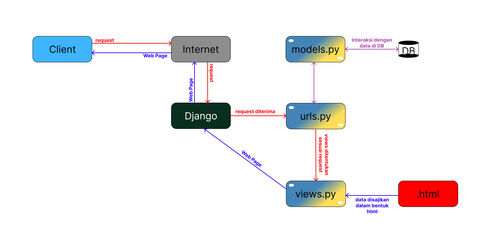

# <p align="center"></p>

This web application is a trading hub, specifically for art and crafts. It is made specifically for one of my college projects, PBP (Programming Berbasis Platform).

<br>

# ⚙️ **USAGE**<br>
You can access the live web application directly from the link below:
[LINK TO WEBPAGE](http://alexander-william-panpanlittleshop.pbp.cs.ui.ac.id/)

If you prefer to open it locally, however, simply clone this repository into your local folder. Make sure to install the requirements using the command `pip install -r requirements.txt`. Without doing so, the Django module would not be detected and the web application would not launch.

<br>

# 🛠️ **CONTRIBUTION**<br>
If you wish to contribute to this project, you can clone the project directly and edit it with any code editor to your liking, assuming that you have Django already setup. If not, you should first get Django installed into your device before proceeding as the application is fully developed within the Django framework.

Here a few links that you might find helpful in setting up your project:
1. [Real Python's Tutorial](https://realpython.com/django-setup/)
2. [Django Official Documentation](https://docs.djangoproject.com/en/5.0/intro/tutorial01/)

<br>

# 📃 **LICENSE**<br>
This project is licensed under the MIT License - refer to the LICENSE file for more details.

<br>

# 📝 **ASSIGNMENT**<br>
**Name** : Alexander William Lim <br>
**NPM** : 2306207505 <br>
**Class** : PBP F

## **TUGAS 3**<br>
### **Step-by-Step Form Setup and Data Delivery Implementation*<br>

**A. Konfigurasi Form**
1. Buatlah sebuah class dengan nama `ProductForm` dalam sebuah berkas baru bernama `forms.py`. Form ini akan digunakan untuk menambahkan produk pada app `main`. Isilah class tersebut sebagai berikut:
```python
class ProductForm(ModelForm):
    class Meta:
        model = Product
        fields = ['name', 'price', 'description', 'stock']
        widgets = {
            'name': forms.TextInput(attrs={'class': 'form-control', 'placeholder': 'Product Name'}),
            'description': forms.Textarea(attrs={'class': 'form-control', 'placeholder': 'Product Description'}),
            'price': forms.NumberInput(attrs={'class': 'form-control', 'placeholder': 'Product Price'}),
            'stock': forms.NumberInput(attrs={'class': 'form-control', 'placeholder': 'Stock Quantity'}),
        }
```

2. Form tersebut nantinya akan ditampilkan saat user melakukan request. Request tersebut akan di proses oleh sebuah fungsi di `views.py` yang seperti berikut:
```python
def add_product(request):
    form = ProductForm(request.POST or None)

    if form.is_valid() and request.method == "POST":
        form.save()
        return redirect("main:show_main")

    context = {'form': form}
    return render(request, "add_product.html", context)
```

**B. Implementasi Data Delivery**
1. Pada `views.py`, tambahkan 4 fungsi baru untuk memroses data yang ada pada database sehingga dapat ditampilkan dalam bentuk json ataupun xml. 

Dua fungsi pertama digunakan untuk menampilkan semua produk masing-masing dalam format json dan xml, dua fungsi lainnya digunakan untuk menampilkan produk sesuai id terpilih dalam format json atau xml.

- `show_xml()`:

```python
def show_xml(request):
    data = Product.objects.all()
    return HttpResponse(serializers.serialize("xml", data), content_type="application/xml")
```

- `show_json()`

```python
def show_json(request):
    data = Product.objects.all()
    return HttpResponse(serializers.serialize("json", data), content_type="application/json")
```

- `show_xml_by_id()`:
```python
def show_xml_by_id(request, id):
    data = Product.objects.filter(pk=id)
    return HttpResponse(serializers.serialize("xml", data), content_type="application/xml")

```

- `show_json_by_id()`:
```python
def show_json_by_id(request, id):
    data = Product.objects.filter(pk=id)
    return HttpResponse(serializers.serialize("json", data), content_type="application/json")
```

2. Setelah menambahkan fungsi-fungsi tersebut pada `views.py`, routing URL untuk setiap **views** juga harus ditambahkan pada berkas `urls.py` dalam direktori main.

```python
...
urlpatterns = [
    path('', show_main, name='show_main'),
    path('add/', add_product, name='add_product'),
    path('xml/', show_xml, name='show_xml'),
    path('json/', show_json, name='show_json'),
    path('xml/<str:id>/', show_xml_by_id, name='show_xml_by_id'),
    path('json/<str:id>/', show_json_by_id, name='show_json_by_id'),
]
...
```

### Mengapa sebuah platform perlu memiliki *data delivery*?

*Data delivery* diperlukan oleh sebuah platform karena beberapa alasan. Berikut adalah beberapa alasan utama mengapa sebuah plaform membutuhkan *data delivery* yang baik:
1. Memungkinkan pengguna atau aplikasi lain untuk menerima data secara *real-time*. 
2. Memungkinkan kontrol lebih baik terhadap siapa yang dapat mengakses data serta distribusi daripada data tersebut, sehingga risiko keamanan dan kebocoran data dapat dikurangi.
3. Waktu respons dari platform dapat menjadi lebih cepat sehingga meningkatkan kepuasan dan produktivitas pengguna.

### XML vs JSON

Dalam konteks aplikasi modern, menurut saya JSON lebih baik daripada XML oleh karena beberapa alasan. 
1. JSON lebih mudah dibaca daripada XML karena menggunakan kurung kerawal `{}` yang diisi dengan data yang ingin ditampilkan, sementara XML menggunakan tags.
2. JSON juga lebih `lightweight` dalam performa penyimpanan. Ini karena JSON tidak perlu menggunakan tags pembuka dan penutup berlebihan untuk menampilkan data. 
3. JSON juga sudah secara alami terintegrasi dengan JavaScript sehingga dapat lebih mudah untuk diparse menjadi sebuah objek JavaScript tanpa melakukan banyak konversi.

### Fungsi `is_valid()` pada form Django

Fungsi `is_valid()`, sesuai namanya, merupakan sebuah fungsi yang dipanggil untuk melakukan validasi data yang di masukkan oleh user. Data type yang valid ditentukan sebelumnya pada `models.py` dari objek yang ingin dibuat.

Fungsi `is_valid()` mengembalikan sebuah nilai dengan data type `boolean`. Jika data yang dimasukkan sesuai dengan models yang telah ditentukan, maka fungsi akan mengembalikan nilai `True`, dan `False` bila sebaliknya. Ini dapat kita gunakan sebagai condition pada conditionals ataupun looping sampai user memasukkan sebuah nilai input yang sesuai.

### Pentingnya `csrf_token` saat membuat form di Django

`csrf_token` merupakan sebuah token yang digunakan untuk melindungi aplikasi dari salah satu serangan kemanan, **CSRF** (Cross-Site Request Forgery), yang melakukan penargetan pada aplikasi web dengan mengirimkan permintaan palsu dari sumber yang tidak sah.

`csrf_token` ini juga bersifat unik, sehingga sangat sulit ditebak oleh penyerang. `csrf_token` ini akan disertakan dalam sebuah form setiap use mengakses atau membuka form. Saat melakukan pengiriman form, token ini akan diverifikasi dan dicek apakah sesuai untuk mengecek apakah berasal dari pengguna yang sah.

### Hasil akses data URL dari Postman
1. Semua produk dalam XML

2. Semua produk dalam JSON

3. Produk tertentu dalam XML

4. Produk tertentu dalam JSON


## **TUGAS 2**<br>
### **Step-by-Step Project Setup Guide** <br>

**A. Konfigurasi Awal Proyek**
1. Pastikan Django sudah terinstall pada perangkat yang akan digunakan.

2. Dengan asumsi Django sudah terinstall, buatlah sebuah direktori lokal baru dengan nama `Pan Pan Little Shop`.

3. Buka terminal baru pada direktori tersebut, dan inisialisasi virtual environment menggunakan perintah berikut.<br>
    ```bash
    python -m venv env
    ```

4. Untuk mengaktifkan virtual environment, perintah berikut dapat digunakan.
    ```bash
    env\Scripts\activate
    ```

5. Setelah selesai melakukan setup virtual environment, buatlah sebuah berkas bernama `requirements.txt` pada direktori yang sama. Isi dari berkas adalah sebagai berikut.
    ```txt
    django
    gunicorn
    whitenoise
    psycopg2-binary
    requests
    urllib3
    ```

6. Lalu, lakukan instalasi *dependencies* menggunakan perintah berikut.
    ```bash
    pip install -r requirements.txt
    ```

7. Hanya setelah melakukan semua langkah-langkah diatas, proyek Django dapat diinisialisasi.
    ```bash
    django-admin startproject pan-pan-little-shop .
    ```

8. Konfigurasi `settings.py` dan menambahkan `localhost` dan `127.0.0.1` pada `ALLOWED_HOSTS`. Tujuan penambahan ini adalah agar kita dapat melakukan local hosting pada perangkat yang kita gunakan.

**B. Persiapan Awal Implementasi MVT**<br>

1. Buka terminal pada direktori proyek `pan-pan-little-shop`. Lalu, jalankan perintah berikut untuk membuat menginisialisasi *main app* baru.
    ```bash
    python manage.py starapp main
    ```

2. Daftarkan `'main'` sebagai item terakhir ke dalam daftar aplikasi `INSTALLED_APPS` pada `settings.py` dari direktori proyek.
    ```python
    INSTALLED_APPS = [
        ...,
        'main'
    ]
    ```

**C. Konfigurasi Templates Main App**<br>
1. Pada direktori `main`, buatlah sebuah direktori baru bernama `templates`.

2. Pada direktori baru tersebut, tambahkan berkas yang dinamakan `main.html`.

3. Isi berkas tersebut dengan desain tampilan yang telah ditentukan menggunakan **HTML**. `localhost` dapat digunakan untuk melihat perubahan yang telah dilakukan pada `main.html`.

**D. Konfigurasi Model Dasar**<br>

1. Pada berkas `models.py` dalam Aplikasi `main`, implementasikan model `Product` dengan menambahkan atribut dan properti menggunakan kode berikut.
    ```python
    from django.db import models

    class Product(models.Model)
        name = models.CharField(max_length=255)
        price = models.IntegerField()
        description = models.TextField()
        stock = models.IntegerField()

        @property
        def is_product_available(self):
            return self.stock > 0
    ```
2. Setelah menambahkan model pada `models.py`, jalankan kedua perintah berikut pada terminal.
    ```bash
    python manage.py makemigrations
    python manage.py migrate
    ```

**E. Menghubungkan View dengan Template**<br>
1. Buka berkas `views.py` pada aplikasi `main`.

2. Bila belum ada, tambahkan baris berikut pada baris-baris import dalam berkas `views.py`.
    ```python
    from django.shortcuts import render
    ```

3. Tambahkan fungsi `show_product()` dan isikan fungsi seperti di bawah ini.
    ```python
    def show_main(request):
        context = {
            'name' : 'Pan-Pan Self Portrait',
            'price': 'Rp. 200.000',
            'stock': '10',
            'description': 'A self portrait of Pan-Pan, the panda.'
        }

    return render(request, "main.html", context)
    ```

4. Modifikasi `main.html` dan ubah semua variabel yang menggunakan variabel yang terdaftar pada `context` di `views.py` dengan sintaks `{{ nama_variabel }}`

**F. Routing URL pada Aplikasi `main` dan proyek** <br>
1. Buat sebuah berkas bernama `urls.py` pada aplikasi main dan tambahkan kode berikut.
    ```python
    from django.urls import path
    from main.views import show_main

    app_name = 'main'

    urlpatterns = [
        path('', show_main, name='show_main'),
    ]
    ```

2. Pada berkas `urls.py` dalam direktori proyek, tambahkan kode berikut.
    ```python
    ...
    from django.urls import path, include
    ...

3. Tambahkan pula kode ini pada variabel `urlpatterns`.
    ```python
    urlpatterns = [
        ...
        path('', include('main.urls'))
        ...
    ]
    ```

**G. *Deployment* pada Pacil Web Service (PWS)**<br>
1. Setelah menyelesaikan semua langkah di atas, kita akan melakukan *deployment* web melalui Pacil Web Service (PWS).

2. Akses halaman PWS dan login menggunakan akun yang sudah terdaftar sebelumnya.

3. Tekan tombol `Create New Project` dan isikan dengan nama pemilik dan nama proyek yang sesuai. Lalu, simpan *credentials* yang akan ditampilkan pada halaman selanjutnya.

4. Pada `settings.py` tambahkan URL *deployment* web dan tambahkan ke dalam `ALLOWED_HOSTS`.

5. Jalankan perintah yang tertera pada tampilan *Project Command* pada PWS.

6. Setelah menjalankan perintah tersebut, kembalikan main branch dengan menggunakan perintah di bawah ini.
    ```bash
    git branch -M main
    ```

### **Bagan *Request Client* ke Django**<br>
</img>

### **Fungsi Git**<br>
Dalam sebuah pengembangan proyek perangkat lunak, `git` memainkan peran yang sangat penting serta menyediakan pengguna dengan beberapa fitur yang akan membantu dalam masa pengembangan. Beberapa diantaranya adalah:
1. ***Version Control*** - *developer* dapat menggunakan `git` sebagai tempat penyimpanan perubahan, dimana setiap perubahan pada kode yang sedang dikerjakan dapat disimpan pada `git`, sehingga akan mudah untuk membedakan versi-versi proyek yang sedang dikerjakan. 

2. **Sarana Kolaborasi** - para *developer* juga dapat dengan mudah berkolaborasi dengan *developer* lain menggunakan fitur-fitur seperti `clone`, `pull-request`, `fork repository`, dll. Ini memudahkan para *developer* jika ingin mengerjakan suatu proyek besar yang membutuhkan lebih dari satu orang untuk menyelesaikannya.

3. **Fleksibilitas Pengembangan Proyek** - `git` juga memungkinkan para *developer* untuk melakukan pengembangan proyek dimanapun dan kapanpun, karena `git` dapat diakses pada perangkat apa pun selama ada koneksi internet.

### Kenapa Django dijadikan *framework* yang pertama kali kami pelajari?
Menurut saya, walaupun ada beberapa hal yang mungkin menjadi pertimbangan para dosen saat memilih *framework* Django sebagai *framework* yang dipelajari, inti dari semua alasan tersebut adalah karena Django sangat *beginner-friendly*. 

Dalam pengembangan web, kita tidak hanya bermain pada tampilan dan logika backend seperti routing, tetapi juga ada basis data yang digunakan untuk melakukan query atau sistem keamanan yang digunakan untuk mencegah serangan siber. Sebagi pemula yang masih memiliki tidak ada sampai sedikit pengetahuan mengenai aspek-aspek tersebut, Django menjadi sebuah pilihan yang terbaik karena sudah menyediakan *library-library* yang dapat langsung digunakan.

### Mengapa model pada Django disebut sebagai *Object-Relational Mapping* (ORM)?
Ini karena Django tidak perlu menggunakan query untuk berinteraksi dengan basis data yang digunakan. Dengan kata lain, Django memungkinkan kita untuk secara langsung berinteraksi dengan basis data yang telah dibuat menggunakan objek yang disediakan oleh Python.
